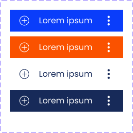

= Technical Documentation: Create authenticate login page

== Author(s)

* Stijn Taelemans

== References

* https://www.wrike.com/open.htm?id=675145293[Wrike task]
* https://docs.google.com/spreadsheets/d/1onOY60hXmEPQYN_nM6CK0uRYIHq7hPtYsE8pWaVe7es/edit#gid=1865680815[Test plan]
* Branch: `feat/675145293-create-authentication-login-page`
* Projects: https://github.com/digita-ai/nde-erfgoedinstellingen[nde-erfgoed-manage, nde-erfgoed-components]

== Introduction

=== Overview

This document is about the the authentication login page. Heritage institutions can enter their WebID on this page, after which they will be redirected to the login page of their identity provider.

=== Out of scope

Routing for the application should not be considered for this feature. This will be implemented for the whole app later.

=== Assumptions

The authenticate feature setup is complete.

All components and services are to be made in the '@digita-ai/nde-erfgoed-manage' package, unless specified otherwise.

== Solution

=== Suggested or proposed solution

==== Components

All new components should be exported in 'lib/index.ts'.

In 'nde-erfgoed-manage', register their HTML tags in app.ts. 

===== ButtonComponent 

The finished component should look like this:

Generate in '@digita-ai/nde-erfgoed-components' package under 'lib/common/button/button.component.ts', with tag `<nde-button>`

These buttons consist of three parts:

* An icon on the left side 
* The text content in the middle 
* An icon on the right side 

Make use of https://lit-element.readthedocs.io/en/v0.6.4/docs/templates/slots/#slot[named slots], https://developer.mozilla.org/en-US/docs/Web/Web_Components/Using_templates_and_slots[MDN] for the icons. When no icon slot is present in the component's body, do not render it. The button should be checked for a `disabled` attribute. When present, use its boolean value to determine whether the button should be disabled or not. A disabled button should always be colored grey (#8990A9), enabled buttons, by default, are colored the 'Primary Light' blue. (#25438E)

Example usage of a button with both icons set:

[source, html]
----
<nde-button>
  <i class="fas fa-angle-left" slot="right-icon"></i>
  <i class="fas fa-angle-right" slot="left-icon"></i>
  Click me!
</nde-button>
----

===== AuthenticateLoginPageComponent

The finished component should look like this:

image::../images/authenticate/authenticate-login-page.svg[AuthenticateLoginPageComponent]

Generate under 'lib/features/authenticate/pages/authenticate-login-page.component.ts' with tag `<nde-authenticate-login-page>`

The page consists two main elements: 

* The header which contains both the NDE logo and a title.
* The WebID input field with a button to its right. Use the previously mentioned <nde-input-field> and <nde-button>.

When a valid WebID is entered and the button is clicked (or the 'Enter' key is pressed), the `AuthenticateEvents.CLICKED_LOGOUT` event should be fired.

While the WebID is being validated, the `ProgressComponent` should be displayed at the top of the page. Validation of the entered WebID should start when the input field was not changed for 250ms. 

The alert visible in the Figma mockup will be implemented later.

==== Translations

The following translations are to be written in the 'nl-NL.json' file. No other languages should be supported. A file named 'nl-BE.json' already exists in the project, rename it (and any other nl-BE references) and extend with the following:

[options="header"]

|======================================

| Key 	| Translation

| `nde.features.authenticate.error.invalid-webid.invalid-url`
| Gelieve een geldig WebID in te voeren. Een WebID start met https://.

| `nde.features.authenticate.error.invalid-webid.no-profile`
| Er werd geen actieve profielpagina gevonden voor deze WebID.

| `nde.features.authenticate.error.invalid-webid.no-oidc-registration`
| De opgegeven WebID is nog niet gelinkt aan een OIDC-provider. Meer info hierover vind je bij de FAQ.

| `nde.features.authenticate.error.invalid-webid.invalid-oidc-registration`
| De opgegeven WebID is gelinkt aan een foutieve OIDC-provider. Meer info hierover vind je bij de FAQ.

| `nde.features.authenticate.pages.login.title`
| Collectiebeheersysteem

| `nde.features.authenticate.pages.login.webid-placeholder`
| E.g. https://profile.janjanssens.nl/

|======================================
