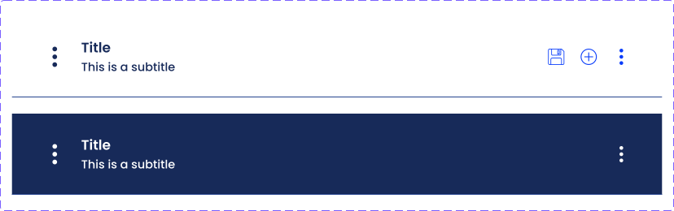

= Technical Documentation: Create content header 
:sectanchors:
:url-repo: https://github.com/netwerk-digitaal-erfgoed/solid-crs
:imagesdir: ../images

== Author(s)

* Stijn Taelemans

== References

* https://www.wrike.com/open.htm?id=682525025[Wrike task]
* Branch: `feat/create-content-header-component`
* Projects: https://github.com/netwerk-digitaal-erfgoed/solid-crs[solid-crs-components]

== Introduction

=== Overview

This document is about the creation of a reusable content header component.

=== Assumptions

All components are to be made in the '@netwerk-digitaal-erfgoed/solid-crs-components' package.

== Solution

=== Suggested or proposed solution

==== ContentHeaderComponent 

The finished component should look like this:

Generate in '@netwerk-digitaal-erfgoed/solid-crs-components' package under 'lib/header/content-header.component.ts', with tag `<nde-content-header>`

Make use of https://lit-element.readthedocs.io/en/v0.6.4/docs/templates/slots/#slot[named slots] for the icon on the left, the title, subtitle and actions to the right. The component should be able to switch colors (see image) based on an 'inverse' property. Take a look at `FormElementComponent`, where it is used to disable the blue border. This component also makes use of slots.

Export the component in 'lib/index.ts'.

To preview the component while developing: register the component in 'lib/demo.ts', then add the component's tag to the 'index.html' file in the 'lib' directory. Running `npm run start:watch` in the 'nde-erfgoed-components' package will serve the 'index.html' file you just edited.
