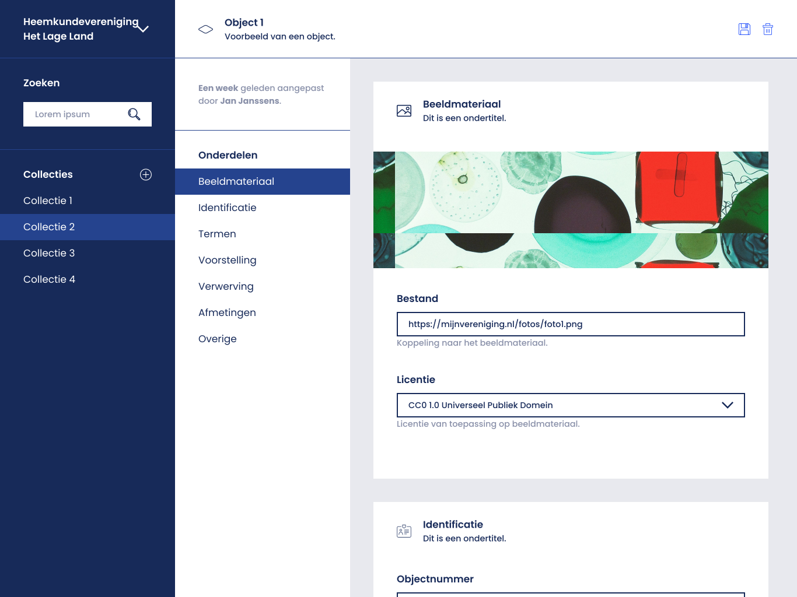

= Technical Documentation: Create object root page

== Author(s)

* Stijn Taelemans

== References

* https://www.wrike.com/open.htm?id=684058826[Wrike task]
* Branch: `feat/create-object-root-page`
* Projects: https://github.com/netwerk-digitaal-erfgoed/solid-crs[nde-erfgoed-manage]

== Introduction

=== Overview

This document is about the creation of a page on which the user can edit every property of a collection object.

=== Assumptions

The collection object feature's basic implementation is finished.

A basic implementation of the `CollectionObjectFormComponent` exists, or should be made. (without semantic components, if this component does not yet exist)

== Solution

=== Suggested or proposed solution

==== Collection 

==== CollectionObjectRootComponent

The finished component should look like this:

Create in '@netwerk-digitaal-erfgoed/solid-crs-manage' package under 'lib/collection-object/collection-object-root.component'.

The component contains a `ContentHeaderComponent` at the top, followed by the `CollectionObjectFormComponent`. The header contains the title and description of the current collection object. These should be made so that, when their text is clicked, they can be edited with input fields, just like collections. The value of these input fields can be saved by clicked the save action on the right, which replaces the edit icon. When editing (`CollectionObjectState.EDITING`), a new cancel icon is shown as well, to leave the editing state. The delete icon in the header should fire the `CollectCollectionObjectEventsionEvents.CLICKED_DELETE` event.

To the right of the `CollectionObjectFormComponent` is a secondary sidebar (inverted). Here, the user more easily scroll through the properties of an object by clicking on their subjects ('Onderdelen'). Currently, five subjects exist:

* Identification
* Creation
* Representation
* Dimensions
* Other
* (Acquisition)

The subjects in Figma are outdated. The ones listed above can be found in the https://github.com/netwerk-digitaal-erfgoed/solid-crs/discussions/163[data model for collection objects], communicated by NDE. 

Each of these subjects, ideally, will have their own Semantic Component. Clicking subjects in the sidebar should automatically scroll to the right component in the `CollectionObjectFormComponent`.

The save button should always be visible in the header. It acts as the submit button for any of the input fields in components inside the `CollectionObjectFormComponent`. Like collection, make sure to not call the save action if the to-be-saved collection contains no changes compared to the original, as this can cause errors. (empty patch requests fail on CSS)

Like the search feature, a user should be able to exit the `CollectionObjectRootComponent` by clicking on one of the collections in primary sidebar. Also make sure a user is able to go to the search results page from the `CollectionObjectRootComponent`.
