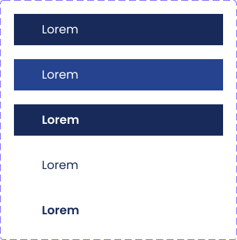

= Technical Documentation: Update sidebar

== Author(s)

* Stijn Taelemans

== References

* https://www.wrike.com/open.htm?id=682525025[Wrike task]
* Branch: `feat/create-content-header-component`
* Projects: https://github.com/digita-ai/nde-erfgoedinstellingen[nde-erfgoed-components]

== Introduction

=== Overview

This document is about the creation of a reusable sidebar list component.

=== Assumptions

All components are to be made in the '@digita-ai/nde-erfgoed-components' package.

== Solution

=== Suggested or proposed solution

==== SidebarListItemComponent 

The finished component should look like this:

Generate in '@digita-ai/nde-erfgoed-components' package under 'lib/sidebar/sidebar-list-item.component.ts', with tag `<nde-sidebar-list-item>`

Make use of https://lit-element.readthedocs.io/en/v0.6.4/docs/templates/slots/#slot[named slots] for the content of the item and action(s) to the right and contain them in a `<li>` tag. The component should be able to switch colors (see image) based on an 'inverse' property. `inverse: true` means the background should be light.

Export the component in 'lib/index.ts'.

To preview the component while developing: register the component in 'lib/demo.ts', then add the component's tag to the 'index.html' file in the 'lib' directory. Running `npm run start:watch` in the 'nde-erfgoed-components' package will serve the 'index.html' file you just edited.

==== SidebarListComponent 

The finished component should look like this:

image::../images/collections/sidebar-list.svg[SidebarItemComponent]

Generate in '@digita-ai/nde-erfgoed-components' package under 'lib/sidebar/sidebar-item.component.ts', with tag `<nde-sidebar-item>`

The purpose of this component is to keep track of the currently selected list item. If any child `<nde-sidebar-list-item>` is clicked, a `selected` class should be added to that element. This class should change the background color of the selected element. (See image, 'Collectie 2')

Export the component in 'lib/index.ts'.

To preview the component while developing: register the component in 'lib/demo.ts', then add the component's tag to the 'index.html' file in the 'lib' directory (add it to the existing sidebar). Running `npm run start:watch` in the 'nde-erfgoed-components' package will serve the 'index.html' file you just edited.
