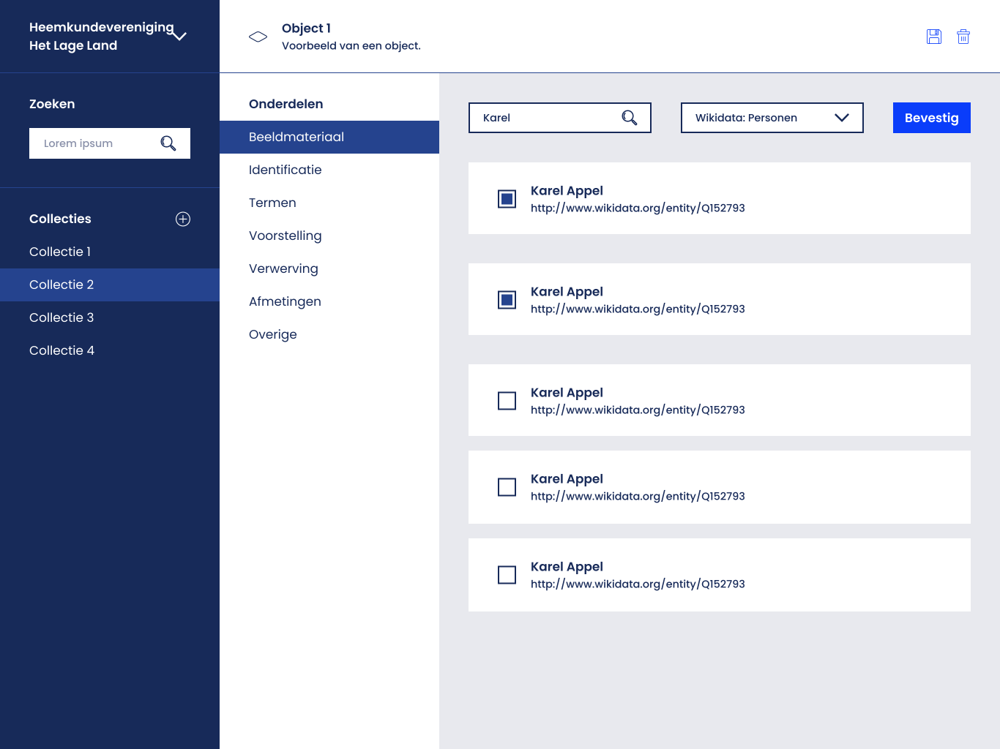

= Technical Documentation: Create term search component
:sectanchors:
:url-repo: https://github.com/netwerk-digitaal-erfgoed/solid-crs
:imagesdir: ../images

== Author(s)

* Stijn Taelemans

== References

// * https://www.wrike.com/open.htm?id=682525025[Wrike task]
* Branch: `feat/create-term-search-component`
* Projects: https://github.com/netwerk-digitaal-erfgoed/solid-crs[nde-erfgoed-components]

== Introduction

=== Overview

This document is about the creation of the component used for querying terms.

== Solution

=== Suggested or proposed solution

==== = Technical Documentation: Update sidebar
:sectanchors:
:url-repo: https://github.com/netwerk-digitaal-erfgoed/solid-crs
:imagesdir: ../images

== Author(s)

* Stijn Taelemans

== References

* https://www.wrike.com/open.htm?id=682525025[Wrike task]
* Branch: `feat/create-content-header-component`
* Projects: https://github.com/netwerk-digitaal-erfgoed/solid-crs[nde-erfgoed-components]

== Introduction

=== Overview

This document is about the creation of a reusable sidebar list component.

=== Assumptions

All components are to be made in the '@netwerk-digitaal-erfgoed/solid-crs-components' package.

== Solution

=== Suggested or proposed solution

The `TermMachine` is created.

==== TermSearchComponent 

The finished component should look like this:

Generate in '@netwerk-digitaal-erfgoed/solid-crs-manage' package under 'lib/features/object/terms/term-search.component.ts', with tag `<nde-term-search>`

Make use of existing `<form-element>` components. Take a look at the demo form component for example usage of a multiple select dropdown.

Making use of properties, pass the search results into the `TermSearchComponent` and display them using `CardComponent` s. Their titles should be the name of the found term, the description is their URI. Set the id of the `CardComponent` to the `uri` of the `Term`. When clicked, send a `TermEvents.CLICKED_TERM` to the `TermMachine`. This should add the selected terms to the `TermMachine` context. (`selected`)

Selected results should show a `CheckboxChecked` svg on the left, otherwise `CheckboxUnchecked`.

Pressing the submit button should fire `SUBMITTED` to the `TermMachine`.
