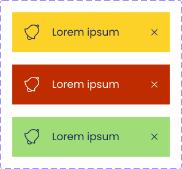

= Technical Documentation: Create authenticate login page

== Author(s)

* Stijn Taelemans

== References

* https://www.wrike.com/open.htm?id=675145293[Wrike task]
* https://docs.google.com/spreadsheets/d/1onOY60hXmEPQYN_nM6CK0uRYIHq7hPtYsE8pWaVe7es/edit#gid=1865680815[Test plan]
* Branch: `feat/675145293-create-authentication-login-page`
* Projects:
** https://github.com/digita-ai/nde-erfgoedinstellingen[nde-erfgoed-manage, nde-erfgoed-components]

== Introduction

=== Overview

This document is about the the authentication login page. Heritage institutions can enter their WebID on this page, after which they will be redirected to the login page of their identity provider.

=== Out of scope

The callback page, which follows the identity provider's login page, is to be made at a later time. 

The notification system should not be implemented yet.

=== Assumptions

The authenticate feature setup is complete.

All components and services are to be made in the '@digita-ai/nde-erfgoed-manage' package, unless specified otherwise.

== Solution

=== Suggested or proposed solution

==== Services

===== SolidService

Create in '@digita-ai/nde-erfgoed-core' package under 'lib/solid/solid.service.ts'.

This service handles everything Solid-related, from authenticating to fetching data. It relies mostly on Inrupt's open source SDKs.

For now, implement only the `login()` function.  
`login(webId: string): void` should throw error messages according to the https://docs.google.com/spreadsheets/d/1onOY60hXmEPQYN_nM6CK0uRYIHq7hPtYsE8pWaVe7es/edit#gid=1865680815[test plan]. 

Test URL validity with `new URL()`. Fetch the WebID. The response should `oidcRegistration` triple should be present on the profile of the given `webId`. The value of this triple should be checked as well. It should return a JSON object at '/.well-known/openid-configuration', which should contain a `solid_oidc_supported` key.

If no error is thrown, the Inrupt SDK's `login()` function should be called, which redirects the user to the OIDC provider's authentication page.

==== Components

All new components should be exported in 'lib/index.ts'.

In 'nde-erfgoed-manage', register their HTML tags in app.ts. 

===== ButtonComponent 

The finished component should look like this:

image::../../assets/authenticate-login-page/button.svg[ButtonComponent]

Generate in '@digita-ai/nde-erfgoed-components' package under 'lib/common/button/button.component.ts', with tag `<nde-button>`

These buttons consist of three parts:

* An icon on the left side 
* The text content in the middle 
* An icon on the right side 

Make use of LitElement's https://lit-element.readthedocs.io/en/v0.6.4/docs/templates/slots/#slot[named slots] for the icons. When no icon slot is present in the component's body, do not render it. The button should be checked for a `disabled` attribute. When present, use its boolean value to determine whether the button should be disabled or not. A disabled button should always be colored grey (#8990A9), enabled buttons, by default, are colored the 'Primary Light' blue. (#25438E)

Example usage of a button with both icons set:

[source, html]
----
<nde-button>
  <i class="fas fa-angle-left" slot="right-icon"></i>
  <i class="fas fa-angle-right" slot="left-icon"></i>
  Click me!
</nde-button>
----

===== NotificationComponent

The finished component should look like this:

Generate in '@digita-ai/nde-erfgoed-components' package under 'lib/common/notification.component.ts' with tag `<nde-notification>`.

Clicking a notification should dispatch the `DISMISS_NOTIFICATION` event.

The changes needed to add notification objects to the state should not be implemented yet.

===== SearchBoxComponent

The finished component should look like this:

image::../../assets/authenticate-login-page/search-box.svg[SearchBoxComponent]

Generate in '@digita-ai/nde-erfgoed-components' package under 'lib/common/search-box.component.ts' with tag `<nde-search-box>`

Use LitElement's https://lit-element.readthedocs.io/en/v0.6.4/docs/templates/slots/#slot[named slots] for displaying the title and (validation error) message, the logo inside the right-side button, as well as the icon inside the input field. When no icon was set for the button, the button should not be shown.  
The placeholder text should be able to be set through an HTML attribute (like a regular input field).  

Example from https://www.figma.com/file/K91OgRUlaDf6fhd95Rjgrg/NDE---CBS?node-id=322%3A2091[Figma's `AuthenticateLoginPageComponent`]:

[source, html]
----
<nde-search-box placeholder="Lorem ipsum">
  
Enter your name

  <nde-button slot="button" disabled="true">
    <i class="fas fa-angle-right" slot="icon-right"></i>
  </nde-button> <!-- A "button" slot is set, so it should be displayed. It is disabled, so the button turns grey --> 
  
WebID is invalid: OIDC registration not set
 <!-- This should be set programatically, based on context.error -->
</nde-search-box>
----

===== ProgressComponent

The finished component can be seen in https://www.figma.com/file/K91OgRUlaDf6fhd95Rjgrg/NDE---CBS?node-id=322%3A2091[the Figma mockup of the `AuthenticateLoginPageComponent`], at the top.

Generate in '@digita-ai/nde-erfgoed-components' package under 'lib/common/loading-bar.component.ts' with tag `<nde-progress>`.

Take a look at https://material.io/components/progress-indicators[material.io's progress indicators].  
This component should be a linear, indeterminate progress indicator. When enabled, it should not move the whole page down, but rather be displayed over everything. (use z-index)

Example usage: 

[source, html]
----
<nde-progress enabled="true"></nde-progress>
----

===== AuthenticateLoginPageComponent

The finished component should look like this:

image::../../assets/authenticate-login-page/authenticate-login-page.svg[AuthenticateLoginPageComponent]

Generate under 'lib/features/authenticate/pages/authenticate-login-page.component.ts' with tag `<nde-authenticate-login-page>`

The page consists two main elements: 

* The header which contains both the NDE logo and a title
* The WebID input field which, in this case, is a <nde-search-box>

When a valid WebID is entered and the button is clicked (or the 'Enter' key is pressed), the `LOGIN` event should be fired.

While the WebID is being validated, the `ProgressComponent` should be displayed at the top of the page.

The notification visible in the Figma mockup will be implemented later.

==== Translations

The following translations are to be written in the 'nl-NL.json' file. No other languages should be supported.

[options="header"]

|======================================

| Key 	| Translation

| `nde.features.authenticate.error.invalid-webid.invalid-url`
| Gelieve een geldig WebID in te voeren. Een WebID start met https://.

| `nde.features.authenticate.error.invalid-webid.no-profile`
| Er werd geen actieve profielpagina gevonden voor deze WebID.

| `nde.features.authenticate.error.invalid-webid.no-oidc-registration`
| De opgegeven WebID is nog niet gelinkt aan een OIDC-provider. Meer info hierover vind je bij de FAQ.

| `nde.features.authenticate.error.invalid-webid.invalid-oidc-registration`
| De opgegeven WebID is gelinkt aan een foutieve OIDC-provider. Meer info hierover vind je bij de FAQ.

| `nde.features.authenticate.pages.login.title`
| Collectiebeheersysteem

| `nde.features.authenticate.pages.login.search-placeholder`
| E.g. https://profile.janjanssens.nl/

|======================================
