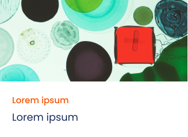

= Technical Documentation: Create object card component

== Author(s)

* Stijn Taelemans

== References

* https://www.wrike.com/open.htm?id=684057264[Wrike task]
* Branch: `feat/create-object-card-component`
* Projects: https://github.com/digita-ai/nde-erfgoedinstellingen[nde-erfgoed-components]

== Introduction

=== Overview

This document is about the creation of a reusable object card, which will be displayed in the collection overview page.

=== Assumptions

All components are to be made in the '@digita-ai/nde-erfgoed-components' package.

== Solution

=== Suggested or proposed solution

==== Collection model

Edit 'collection.ts' under 'lib/collections/' in the 'nde-erfgoed-core' package.

[source, ts]
----
{
  uri: string, // identifier
  name: string,
  description: string,
}
----

==== CollectionObject model

Create 'collection-object.ts' under 'lib/collections/' in the 'nde-erfgoed-core' package.

[source, ts]
----
{
  uri: string, // identifier
  name: string,
  description: string,
  image: string,
  subject: string, // e.g. Molen
  type: string, // icon
  updated: string, // unix timestamp
}
----

==== ObjectCardComponent 

The finished component should look like this:

Generate in '@digita-ai/nde-erfgoed-components' package under 'lib/collection-object/object-card.component.ts', with tag `<nde-object-card>`

The component should feature an input property for a `CollectionObject`. The `name` and `description` should go in the title and subtitle of the component. The `image` is the top part of the component and should fit the whole area. 

Hovering over the component should change the cursor as if the component is clickable. The actual onclick functionality should be implemented by the page that uses the component.

Export the component in 'lib/index.ts'.

To preview the component while developing: register the component in 'lib/demo.ts', then add the component's tag to the 'index.html' file in the 'lib' directory. Running `npm run start:watch` in the 'nde-erfgoed-components' package will serve the 'index.html' file you just edited.
