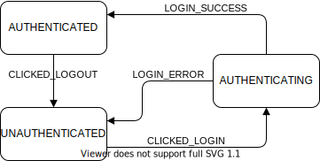

= Technical Documentation: Set up authenticate feature

== Author(s)

* Stijn Taelemans

== References

* https://www.wrike.com/open.htm?id=674718417[Wrike task]
* Branch: `feat/599439372-set-up-authenticate-feature`
* Project:
https://github.com/digita-ai/nde-erfgoedinstellingen[nde-erfgoed-manage]

== Introduction

=== Overview

This document is about the setup of the authentication feature. Heritage institutions should be able to authenticate to the heritage management application with their WebIDs. 

=== Out of scope

Any visual components or implementations of services for the authentication feature are to be made at a later time.

=== Assumptions

The initial project setup is complete.

== Solution

=== Suggested or proposed solution

==== Authentication Feature

Under 'lib/features', create new 'authenticate' directory. In here, create the following files:

* authenticate.machine.ts
* authenticate.states.ts
* authenticate.context.ts
* authenticate.actions.ts
* authenticate.events.ts

==== Authenticate Machine & States

Create `authenticateMachine`, `AuthenticateActors` in 'lib/features/authenticate/authenticate.machine.ts'.

Create `AuthenticateStates`, `AuthenticateState` and `AuthenticateSchema` in 'lib/features/authenticate/authenticate.states.ts'.

See https://xstate.js.org/docs/guides/machines.html#configuration[XState Machines documentation].

The `authenticateMachine` has three possible states: 

* `AuthenticateState.UNAUTHENTICATED` (initial)
* `AuthenticateState.AUTHENTICATING`
* `AuthenticateState.AUTHENTICATED`

The `UNAUTHENTICATED` state is the initial state of the machine. From here, it can transition to the `AUTHENTICATING` state when the `CLICKED_LOGIN` event is called. The machine should be in the `AUTHENTICATING` state from the moment the button is clicked. The app should transition to `AUTHENTICATED` using the `LOGIN_SUCCESS` event when the `handleIncomingRedirect()` function is called and its return value contains a `isLoggedIn` attribute equal to `true`. Should `isLoggedIn` be `false`, a `LOGIN_ERROR` event should be dispatched and the machine should return to its initial state. After `LOGIN_SUCCESS`, we reach the `AUTHENTICATED` state. From this state, the machine can go back to the `UNAUTHENTICATED` state when a `CLICKED_LOGOUT` action is fired.

Take a look at the existing `CollectionsState(s)`, `CollectionsSchema`, `CollectionsActors` ('lib/features/collections/collections.states.ts') and `collectionsMachine` ('lib/features/collections/collections.machine.ts') for inspiration on how to set up an XState machine.

==== AuthenticateContext

Create in 'lib/features/authenticate/authenticate.context.ts'

The context of the `AuthenticateMachine` is relatively simple. It contains the session info returned by the Inrupt authentication client. The session info can be used to retrieve the user's WebID or session ID.

[source, js]
----
{
  sessionInfo: ISessionInfo,
}
----

==== Actions and Events

Create following events in 'lib/features/authenticate/authenticate.events.ts'

Take a look at https://github.com/digita-ai/nde-erfgoedinstellingen/blob/develop/packages/nde-erfgoed-manage/lib/features/collections/collections.events.ts[collections.events.ts] and https://github.com/digita-ai/nde-erfgoedinstellingen/blob/develop/packages/nde-erfgoed-manage/lib/features/collections/collections.actions.ts[collections.actions.ts].
.

[options="header"]

|======================================

| Event 	| Payload

| `CLICKED_LOGIN`
| `webId: string`

| `LOGIN_SUCCESS`
| `sessionInfo: ISessionInfo`

| `LOGIN_ERROR`
| `msg: string`

| `CLICKED_LOGOUT`
| No payload

|======================================

Create following actions in 'lib/features/authenticate/authenticate.actions.ts'

[options="header"]

|======================================

| Action 	| Description

| `login(webId: string)`
| Should call the `SolidService.login(webId: string)` function.

| `setSessionInfo(sessionInfo: ISessionInfo)`
| Should set `context.sessionInfo` to `sessionInfo`.

| `escalateError(msg: string)`
| Logs the error message to console. (placeholder, this should be implemented by https://github.com/digita-ai/nde-erfgoedinstellingen/issues/24[#24])

| `logout()`
| Should call the `SolidService.logout()` function and remove any `context.sessionInfo`.

|======================================

==== Components

===== AuthenticateRootComponent

Generate under 'lib/features/authenticate/root/authenticate-root.component.ts'

Set up an empty Web Component for now. This component will be fleshed out when the other authentication-related components are made. Its purpose is to house the `AuthenticateLoginPageComponent`, to be made later.

==== Configuring the App Machine

The `authenticateMachine` should be configured in the `AppMachine` as a https://xstate.js.org/docs/guides/parallel.html#parallel-state-nodes[parallel state node].
